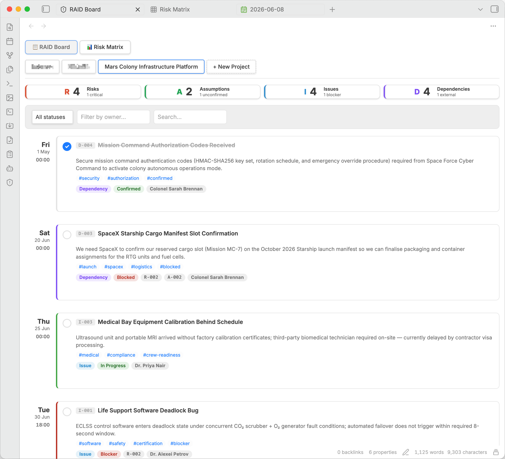
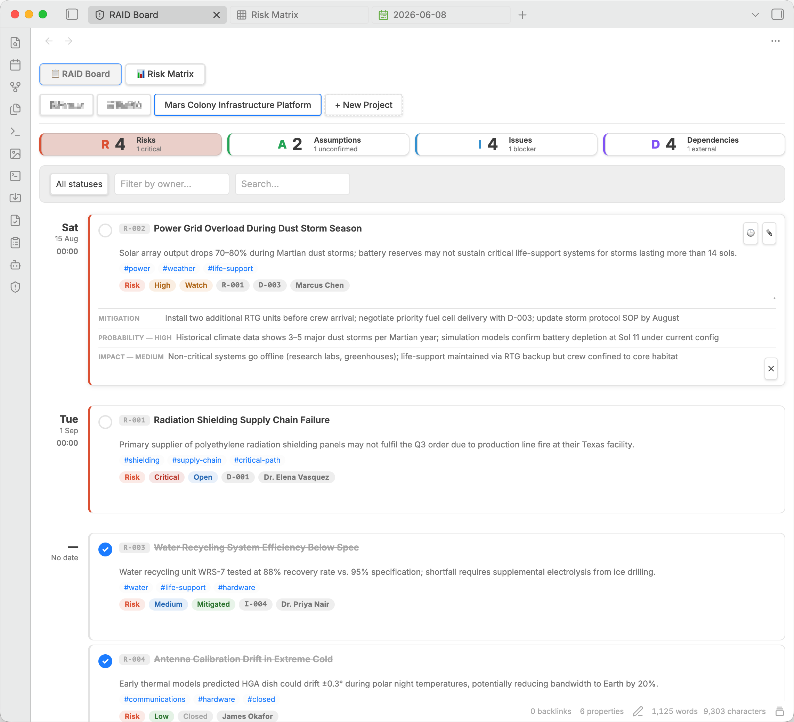
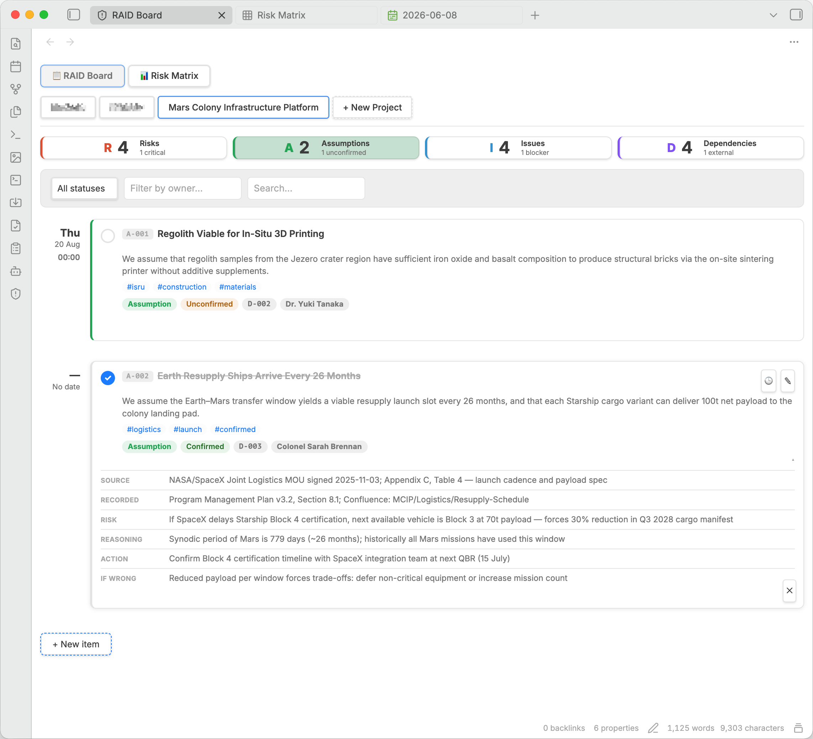
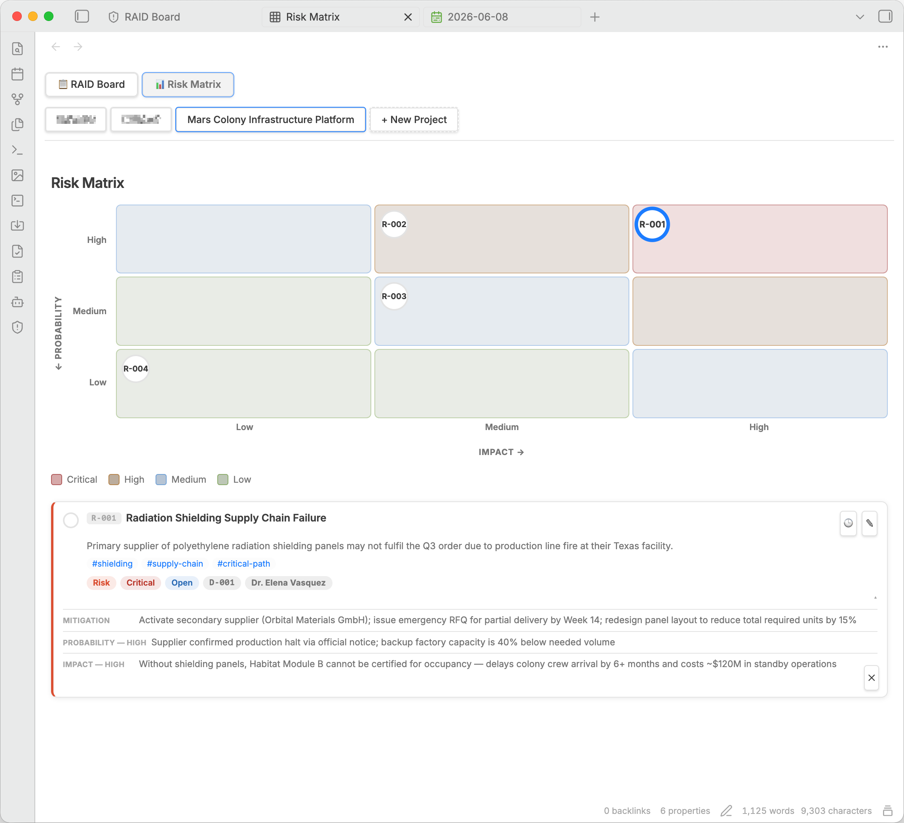
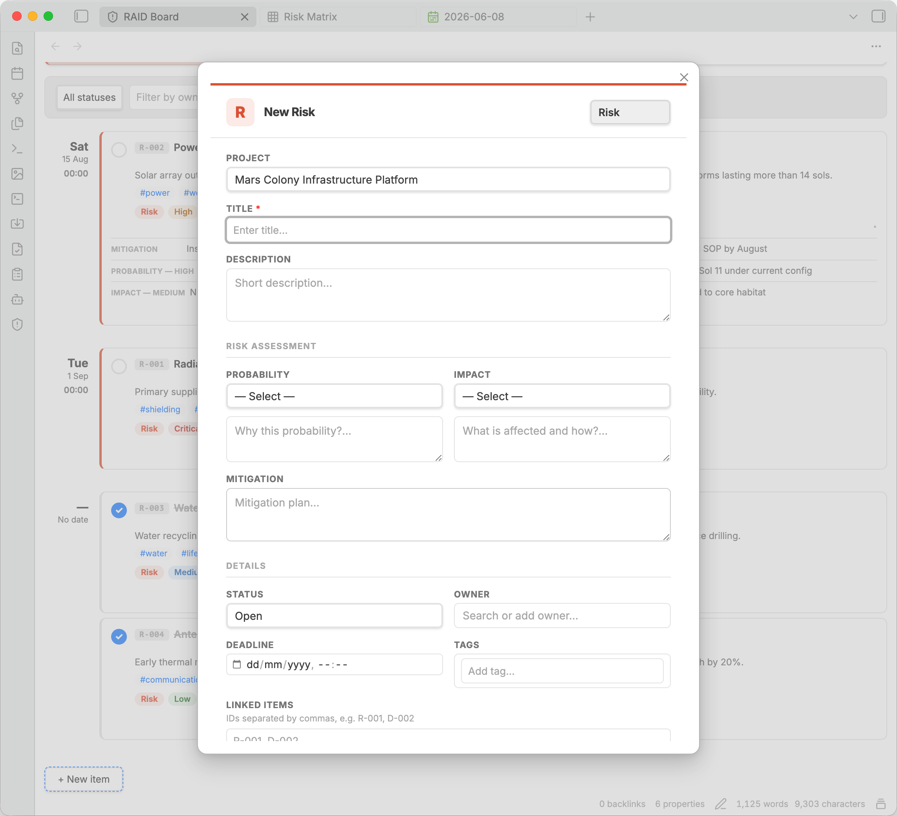

# Obsidian Risk RAID

> RAID log management with interactive risk matrix for Obsidian.md

---

## What it does

**Risk RAID** adds a full RAID log (Risks, Assumptions, Issues, Dependencies) to your Obsidian vault. All data lives in plain Markdown files — one file per project — so it works with Obsidian Sync, Git, and any text editor.

### RAID Board

A card-based view of all your RAID items:

- **Summary strip** — 4 stat cards (Risks / Assumptions / Issues / Dependencies) that double as type-filter buttons. Click to filter, click again to show all. On mobile the strip collapses to 2×2.
- **Filter bar** — filter by status, owner, or free-text search (all inputs are debounced)
- **Item cards** — compact view with expandable detail panel. Click a card to reveal contextual fields (mitigation, reasoning, impact, contact, etc.). Edit button (top-right) opens the full form. Quick-toggle checkbox marks an item done/open. History button (🕒) shows the full audit trail.
- **Project tabs** — switch between projects; double-click a tab to open the project file



Clicking a card expands the detail panel with all contextual fields for that type and status:



Type filtering is instant — click the **A** card to see only Assumptions, with their full detail:



### Risk Matrix

An interactive 3×3 probability × impact grid. All risks are plotted automatically. Click a bubble to show the full risk card below the legend; right-click for the context menu. If a cell has more than 3 risks, a **+N** button expands all hidden bubbles inline.



### Create / Edit Form

Type-aware modal form with:
- Context-sensitive fields per type and status (changing status rebuilds the form)
- Live severity preview in the Risk Assessment divider row
- Multi-chip tag input with autocomplete
- Owner autocomplete sourced from the vault



### History / Audit Trail

Every save records a human-readable diff entry. Click the 🕒 button on any card to see the full timeline.

### Settings

- RAID folder path
- Default view (board / matrix)
- Auto-open on startup
- Show severity colors (ON = severity colors on card borders; OFF = RAID type colors)
- Owner and tag pools (auto-collected from vault items)

---

## Storage format

Each project is a single `.md` file. Items are stored as `## {ID} {Title}` sections with a ` ```raid ``` ` YAML code block:

```markdown
---
project-name: "My Project"
---

# My Project — RAID Log

## R-001 Compliance sign-off risk
```raid
probability: high
impact: high
severity: critical
status: open
owner: "Andrey K."
description: "Compliance queue is 3 weeks. Risk of missing UAT sign-off."
mitigation: "Submit package early, escalate via CDO if no response in 5 days"
tags: [compliance, launch]
created-at: "2026-06-03T10:00:00.000Z"
updated-at: "2026-06-03T10:00:00.000Z"
history:
  - date: "2026-06-03T10:00:00.000Z"
    changes: [Item created]
\```
```

IDs are auto-generated (`R-001`, `A-001`, `I-001`, `D-001`). You can edit the YAML manually — the plugin re-parses on every save.

---

## Installation (development)

```bash
git clone https://github.com/AndreyKolygin/obsidian-risk-raid
cd obsidian-risk-raid
npm install
npm run build
```

Copy `main.js`, `manifest.json`, and `styles.css` to:
```
{your-vault}/.obsidian/plugins/obsidian-risk-raid/
```

Enable the plugin in **Obsidian → Settings → Community plugins → Risk RAID**.

---

## Usage

1. Click the **shield icon** in the ribbon to open the RAID Board
2. Click **+ New Project** to create your first project
3. Click **+ New item** to add a RAID entry
4. Use the **R / A / I / D stat cards** to filter by type
5. Click any card to expand its details; click ✎ to edit; click 🕒 to see history
6. Switch to the **Risk Matrix** via the view switcher at the top

---

## Field reference

See [`RAID-FIELDS.md`](./RAID-FIELDS.md) for the complete YAML field reference per type and status.

---

*Built for project managers who live in Obsidian.*
